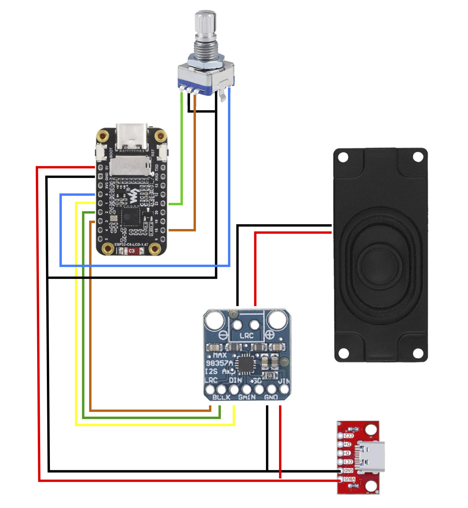

# ESP32-C6 Bedside Clock

A feature-rich bedside clock built on the Waveshare ESP32-C6 development board with integrated 1.47" LCD display, live weather, MP3 alarm with snooze, and a rotary encoder menu — all configurable via a built-in web interface.


[](https://creativecommons.org/licenses/by-nc/4.0/)

Find the 3D-printable model files here: <https://makerworld.com/en/models/2580834-bedside-clock>

Support my work: <https://buymeacoffee.com/kl.design>

> **By K.L Design**

[](https://www.youtube.com/watch?v=3SUdX7Zpfpg)
*👆 Click to watch on YouTube*
---

## Features

### Clock & Weather
- Large custom font clock display with automatic NTP time sync
- Automatic timezone and DST handling via Open-Meteo Geocoding API
- Live weather with pre-rendered Meteocons icons (sunny, cloudy, rain, snow, fog, thunderstorm, etc.)
- Current temperature with daily high/low display
- Weather refreshes every 15 minutes
- Balanced layout: clock and date on the left 3/4, weather panel on the right 1/4

### Alarm System
- MP3 alarm playback from SD card via I2S amplifier with pre-read audio buffer to prevent dropouts on shared SPI bus
- Continuous looping of the alarm sound until snoozed or dismissed
- One-shot alarm — fires once at the set time, then auto-disables (re-arm for the next day)
- Adjustable volume (0–100%) with live preview
- Sound file selection from all MP3s found on the SD card
- Test playback to preview the alarm sound at the current volume
- Configurable snooze duration (1–30 minutes) with a live countdown on screen
- Random inspirational wake-up messages displayed when the alarm fires

### Snooze
- **Tap** the encoder button while the alarm is ringing to snooze
- Display shows `Snooze: M:SS` in cyan with a live countdown
- When the countdown reaches zero, the alarm fires again with looping audio
- Snooze indefinitely until you're ready to get up
- **Long press** (1 second) to fully dismiss the alarm
- Menu is blocked during alarm and snooze states to prevent accidental changes

### Color-Coded Display States
| State | Color | Display |
|-------|-------|---------|
| Alarm armed | Red | `Alarm: 07:00` |
| Alarm firing | Warm gold | Random inspirational message |
| Snooze countdown | Cyan | `Snooze: 4:32` |

### On-Screen Menu (Rotary Encoder)
A full settings menu accessible by holding the encoder button for 1 second:

```
  Brightness:              75%
  Wake up:               07:00
  Alarm:                    On
  Snooze:                5 min
  Tune:             alarm.mp3
  Volume:                  50%
  Test:                  Play
  Webpage:                  On
```

- **Rotate** to navigate between items
- **Press** to enter edit mode (value turns green), rotate to adjust, press to confirm
- **Alarm** and **Webpage** toggle instantly on press (no edit mode needed)
- **Test** toggles sound playback instantly on press
- **Wake up** has two-stage editing: press to edit hour `[07]:00`, press again for minute `07:[00]`, press to save
- **Long press** (1 second) exits the menu from anywhere
- Long filenames are truncated with `...` to prevent overflow
- All settings are persisted to flash memory and survive reboots
- Interrupt-driven rotary encoder ensures reliable navigation even during fast rotation

### Web Interface
A responsive, dark-themed web interface accessible from any device on the same network:

- **Home page** — Set alarm time (24h format dropdowns), toggle alarm on/off, select alarm sound, adjust volume with slider, test playback, adjust display brightness
- **Manage Sound Files** — Upload new MP3 files to the SD card with a progress bar, download files with live progress on the button, view file list with file sizes, delete unwanted files, wipe entire SD card with double confirmation, see SD card usage statistics
- **Location Settings** — Search for your city using the Open-Meteo Geocoding API, timezone is set automatically
- **Firmware Update** — OTA (Over-The-Air) firmware updates with upload progress bar, automatic reboot detection, and redirect to home page when the device comes back online
- **Web access control** — Enable/disable the entire web interface from the on-screen menu to prevent unauthorized access. When disabled, all endpoints return `403 Forbidden`. OTA updates and the AP config portal remain accessible for recovery.

### Captive Portal Setup (AP Mode)
- On first boot (or when no WiFi credentials are saved), the clock creates its own WiFi access point
- Connect to the AP and a captive portal opens automatically for WiFi configuration
- Supports WiFi network scanning with signal strength display
- Hold the **BOOT button** (GPIO9) for 5 seconds at any time to force AP mode and reconfigure WiFi — a progress bar on screen shows the hold duration

### MP3 File Management
- Upload MP3 files to the SD card via the web interface with a real-time progress bar
- Download MP3 files from the SD card with live progress percentage on the download button
- Delete files directly from the file manager page
- Currently active alarm sound is highlighted in gold
- SD card total and used space displayed at the bottom of the file manager
- Files are automatically rescanned on boot and after every upload or delete
- If the active alarm sound is deleted, the alarm sound setting is automatically cleared
- Supports up to 32 MP3 files in the root directory of the SD card
- Wipe SD Card button with double confirmation to remove all files and reset alarm sound
- Auto-selects the first available MP3 as alarm sound when no sound is set or the active file is missing

---

## Hardware

> **Support this project:** The product links below are affiliate links. If you purchase through them, I earn a small commission at no extra cost to you — it's a simple way to help fund continued development. Thank you!

### Components
| Component | Description | Link |
|-----------|-------------|------|
| Waveshare ESP32-C6 1.47" LCD | All-in-one dev board: ESP32-C6 (RISC-V, WiFi 6, BLE 5), 320×172 ST7789 display, and onboard SD card slot | [Amazon.se](https://www.amazon.se/dp/B0FC6JTRYT?tag=kldesign-21) · [Amazon.com](https://www.amazon.com/dp/B0F4DDDQSM?tag=kldesign00-20) |
| MAX98357 | I2S mono amplifier for audio output | [Amazon.se](https://www.amazon.se/dp/B09PL7DSK5?tag=kldesign-21) · [Amazon.com](https://www.amazon.com/dp/B0DPJRLMDJ?tag=kldesign00-20) |
| EC11 Rotary Encoder | 7-pin, with push button for navigation | [Amazon.se](https://www.amazon.se/dp/B07RM2JCJQ?tag=kldesign-21) · [Amazon.com](https://www.amazon.com/dp/B0BP6G8D7B?tag=kldesign00-20) |
| MicroSD Card | FAT32 formatted, for alarm MP3 files | [Amazon.se](https://www.amazon.se/dp/B0054KHY8C?tag=kldesign-21) · [Amazon.com](https://www.amazon.com/dp/B07JH48HBL?tag=kldesign00-20) |
| Speaker | Connected to MAX98357 output terminals | [Amazon.se](https://www.amazon.se/dp/B09PL6XFHB?tag=kldesign-21) · [Amazon.com](https://www.amazon.com/dp/B0F9NZZFRH?tag=kldesign00-20) |

### Wiring Diagram



### Pinout

The display and SD card are integrated on the Waveshare board with fixed pin assignments. The following pins are used for external components:

#### Onboard Display (ST7789 SPI — factory wired)
| Signal | GPIO |
|--------|------|
| DC | 15 |
| CS | 14 |
| SCK | 7 |
| MOSI | 6 |
| RST | 21 |
| Backlight | 22 |

#### Onboard SD Card (shared SPI bus — factory wired)
| Signal | GPIO |
|--------|------|
| MISO | 5 |
| CS | 4 |
| SCK | 7 (shared) |
| MOSI | 6 (shared) |

#### MAX98357 I2S Amplifier
| Signal | GPIO |
|--------|------|
| BCLK | 2 |
| LRC (WSEL) | 3 |
| DIN | 1 |
| VIN | 3.3V or 5V |
| GND | GND |

#### EC11 Rotary Encoder
| Signal | GPIO |
|--------|------|
| CLK (A) | 18 |
| DT (B) | 23 |
| SW (button) | 0 |
| GND (encoder) | GND |
| GND (switch) | GND |

No external pull-up resistors are needed — the code enables internal pullups on all encoder pins.

#### Other
| Signal | GPIO |
|--------|------|
| BOOT button | 9 (hold 5s → AP mode) |

---

## Software Dependencies

### Arduino Libraries

| Library | Purpose | License |
|---------|---------|---------|
| [Arduino_GFX](https://github.com/moononournation/Arduino_GFX) | Display driver for ST7789 | BSD |
| [LVGL 8.4](https://github.com/lvgl/lvgl) | Graphics UI framework | MIT |
| [ESP8266Audio](https://github.com/earlephilhower/ESP8266Audio) | MP3 decoding and I2S audio output (incl. AudioFileSourceBuffer) | GPL-3.0 |
| [ESPAsyncWebServer](https://github.com/me-no-dev/ESPAsyncWebServer) | Async web server for config pages and file uploads | LGPL-2.1 |
| [AsyncTCP](https://github.com/me-no-dev/AsyncTCP) | TCP library required by ESPAsyncWebServer | LGPL-3.0 |
| SD | SD card access | Built-in |
| SPI | SPI bus | Built-in |
| WiFi | WiFi connectivity | Built-in |
| DNSServer | Captive portal DNS | Built-in |
| Preferences | Persistent settings storage (NVS) | Built-in |
| HTTPClient | Weather API requests | Built-in |
| Update | OTA firmware updates | Built-in |

### LVGL Configuration (`lv_conf.h`)

The following built-in Montserrat fonts must be enabled:

```c
#define LV_FONT_MONTSERRAT_10  1   // Menu hint text
#define LV_FONT_MONTSERRAT_12  1   // Small UI text, IP address
#define LV_FONT_MONTSERRAT_14  1   // Menu items, weather hi/lo, date
#define LV_FONT_MONTSERRAT_16  1   // Boot screen status
#define LV_FONT_MONTSERRAT_20  1   // Date display, alarm/snooze label
#define LV_FONT_MONTSERRAT_24  1   // Weather current temperature
```

A custom large clock font (`lv_font_clock_big.c`) is used for the main time display.

### External APIs

| API | Purpose | Auth |
|-----|---------|------|
| [Open-Meteo Weather](https://open-meteo.com/) | Current weather + daily high/low forecast | None (free, no key required) |
| [Open-Meteo Geocoding](https://open-meteo.com/en/docs/geocoding-api) | City search for automatic timezone/location | None (free, no key required) |
| NTP (pool.ntp.org) | Time synchronization | None |

---

## Architecture Notes

### Async Web Server Safety
ESPAsyncWebServer runs its callbacks from the WiFi/TCP task, not the Arduino `loop()`. Directly calling audio functions (start/stop/volume) or LVGL UI updates from web handlers causes race conditions, use-after-free crashes, and corrupted playback state. All audio and UI operations requested by web endpoints are deferred via volatile command flags and processed safely in the main loop:

- `audioReqTestStart` / `audioReqTestStop` — test playback control
- `audioReqDismiss` — alarm dismiss from web
- `audioReqVolume` — volume changes from web sliders
- `uiReqAlarmLabel` — alarm label refresh

### Audio Buffering
MP3 playback uses `AudioFileSourceBuffer` (2KB) wrapping `AudioFileSourceSD` to absorb SPI bus contention when the LCD and SD card share the same SPI bus. Without this buffer, display flushes can starve the audio decoder and cause mid-song dropouts.

### Rotary Encoder
The encoder uses interrupt-driven full quadrature decoding (ISR on both CLK and DT edges via `CHANGE`). A 16-entry state table maps every transition to +1, -1, or 0 (invalid/bounce), ensuring reliable direction detection even at high rotation speeds. Raw edge counts are divided by 4 (EC11 standard) to emit one step per detent.

---

## Project Files

| File | Description |
|------|-------------|
| `BedsideClock.ino` | Main sketch — all logic in a single file |
| `lv_conf.h` | LVGL configuration (place in your LVGL library folder) |
| `lv_font_clock_big.c` | Custom large clock font for LVGL |
| `weather_icons.h` | Weather icon declarations |
| `icon_*.c` | Pre-rendered Meteocons weather icon bitmaps |

---

## Setup

### 1. Hardware Assembly
Connect the external components to the Waveshare ESP32-C6 board according to the pinout tables above. The display and SD card are already integrated on the board — you only need to wire the MAX98357 amplifier, EC11 rotary encoder, and speaker.

### 2. SD Card
- Format as **FAT32**
- Place `.mp3` files in the **root directory**
- Up to 32 files are supported
- Files can also be uploaded later via the web interface

### 3. Arduino IDE Setup
1. Install the **ESP32** board package (select ESP32-C6 as your board)
2. Install libraries available through the Arduino Library Manager:
   - **Arduino_GFX** — search "Arduino_GFX" in Library Manager
   - **LVGL** (v8.4.x) — search "lvgl" in Library Manager
   - **ESP8266Audio** — search "ESP8266Audio" in Library Manager
3. Install **AsyncTCP** and **ESPAsyncWebServer** manually (not available in Library Manager):
   - Download [AsyncTCP](https://github.com/me-no-dev/AsyncTCP) → Click **Code** → **Download ZIP**
   - Download [ESPAsyncWebServer](https://github.com/me-no-dev/ESPAsyncWebServer) → Click **Code** → **Download ZIP**
   - In Arduino IDE: **Sketch** → **Include Library** → **Add .ZIP Library...** → select `AsyncTCP-main.zip`
   - Repeat for `ESPAsyncWebServer-main.zip`
4. Place `lv_conf.h` in the same folder as `BedsideClock.ino`
5. Open `BedsideClock.ino` and upload

### 3b. Flash Pre-Compiled Binary (No Arduino IDE Required)

If you don't want to set up the Arduino IDE and compile the firmware yourself, you can flash a pre-built binary directly to the ESP32-C6 using a web browser.

#### What You Need

- A **Chrome** or **Edge** browser (Web Serial is not supported in Firefox or Safari)
- A **USB-C cable** connected to the Waveshare ESP32-C6 board
- The merged firmware `.bin` file from the [`/Firmware`](https://github.com/anticolon/BedsideClock/tree/main/Firmware) folder in this repo

#### Steps

1. Download the latest `BedsideClock_vX.X_merged.bin` from the [`/Firmware`](https://github.com/anticolon/BedsideClock/tree/main/Firmware) folder
2. Open the [**Espressif Web Flasher**](https://espressif.github.io/esptool-js/) in Chrome or Edge
3. Click **Connect** and select the port for your ESP32-C6
4. In the **Program** section, enter **`0x0`** in the Flash Address field
5. Click the file picker next to the address and select the downloaded `.bin` file
6. Set Flash Mode as **dio** and Flash Size as **4MB**
7. Click **Program**
8. Wait for flashing to complete — progress will show in the Console section at the bottom
9. After programming is complete click the **rst** button on the ESP32 board to reboot
10. The clock should now boot up and enter AP mode for WiFi setup

**Tip:** If the board doesn't show up as a COM port, hold the **BOOT** button on the Waveshare board while plugging in USB, then release after connecting.

#### Updating Firmware Later

Once the clock is on your WiFi, go to the web UI → **Firmware Update** page and upload the **app-only** `.bin` file (not the merged binary). The merged binary is only needed for the initial USB flash.

### 4. First Boot — WiFi Configuration
1. The clock starts in **AP mode** and creates a WiFi access point
2. Connect to it with your phone or laptop
3. A captive portal opens automatically — select your WiFi network and enter the password
4. The clock reboots, connects to WiFi, syncs time via NTP, and fetches weather

### 5. Configure Location
1. Navigate to the clock's IP address (shown at the bottom right of the display)
2. Click **Location Settings**
3. Search for your city — timezone and coordinates are set automatically
4. Save — weather data updates immediately

---

## Usage

### Daily Use
The clock displays the time, date, current weather icon, temperature, and daily high/low. When an alarm is armed, the set time appears in red below the date. The clock's IP address is shown in the bottom right corner for easy web access.

### Setting an Alarm
**Via the on-screen menu:** Hold the encoder button for 1 second to open the menu. Navigate to *Wake up* and press to edit the time. Then navigate to *Alarm* and press to toggle it on.

**Via the web interface:** Open the clock's IP in a browser, set the hour and minute with the dropdown selectors, and toggle the switch to arm. You can also select the alarm sound, adjust volume, and test playback.

### When the Alarm Fires
1. A random inspirational message appears in warm gold text
2. The selected MP3 plays continuously on loop
3. **Tap** the encoder to snooze — the display shows a cyan countdown timer
4. When the snooze timer expires, the alarm fires again
5. **Long press** the encoder (1 second) to fully dismiss the alarm
7. The alarm auto-disables after firing — re-arm it for the next day

### Managing Sound Files
Navigate to the clock's IP → **Manage Sound Files** to:
- **Upload** new MP3 files with a visual progress bar
- **Download** files from the SD card with live progress on the button
- **Delete** files you no longer want
- **Wipe SD Card** to remove all files with double confirmation
- See file sizes and total SD card usage
- The currently active alarm sound is highlighted in gold

### Updating Firmware
Navigate to the clock's IP → **Firmware Update** to upload a new `.bin` file. The page shows upload progress, then automatically detects when the device reboots and redirects to the home page.

### Disabling the Web Interface
For security, you can disable the web interface from the on-screen menu. Navigate to *Webpage* and press to toggle it off. When disabled, all web requests return `403 Forbidden`. The setting persists across reboots. OTA firmware updates and the AP captive portal are not affected, so you can always recover access.

### Re-entering WiFi Setup
Hold the **BOOT button** (GPIO9) for 5 seconds — a progress bar appears at the bottom of the screen showing the hold duration. The clock restarts in AP mode for WiFi reconfiguration.

---

## Inspirational Wake-Up Messages

When the alarm fires, one of these messages is randomly chosen and displayed in warm gold:

- *Have a wonderful day!*
- *This day is full of potential!*
- *Dad loves you!*
- *Mom loves you!*
- *You are beautiful!*
- *You make the world brighter!*
- *Today is going to be amazing!*
- *You are so loved!*
- *The world needs your smile!*
- *You are stronger than you know!*
- *Great things await you today!*
- *You are enough, always!*
- *Today is yours to shine!*
- *Be proud of who you are!*
- *Your family believes in you!*

The same message persists through snooze cycles — a fresh random pick happens the next time the alarm triggers.

---

## Changelog

### v1.0.8
- **Reliable chunked upload** — Rewrote upload to close-per-chunk: each 32KB chunk opens, writes, flushes, and closes the file instead of holding a static file handle across 150+ HTTP requests. Fixes SPI bus contention between SD card and LCD that caused silent file truncation
- **Error propagation** — Upload body handler now reports SD write failures to the response handler via `uploadError` flag, returning HTTP 500 instead of silent 200. Browser detects errors and stops uploading
- **Server-side write retry** — Short writes retry up to 3 times with 10ms SPI settle delay between attempts
- **Client-side chunk retry** — Failed or timed-out chunks retry up to 3 times with 1-second backoff; status bar shows retry progress in yellow
- **Partial file cleanup** — Added `/files/upload_abort` endpoint; on final failure the client deletes the partial file from SD so no ghost files appear in the file list
- **Inter-chunk pacing** — 50ms delay between chunks on the client side gives the ESP32 a clean SPI bus window between SD close and next open
- **Chunk size increase** — Increased from 8KB to 32KB, reducing HTTP round-trips ~4x
- **XHR timeout** — Added 30-second timeout on the client side to catch stalled requests

### v1.0.5
- **Chunked MP3 uploads** — Replaced single multipart upload with chunked sequential uploads via `/files/upload_chunk`, with filename, offset, and total size in HTTP headers. First chunk creates the file, subsequent chunks append. Fixes large MP3 files (4MB+) being truncated
- **Skip display flush during upload** — LCD and SD card share the same SPI bus; concurrent display writes were colliding with SD card writes, corrupting upload data. Display freezes briefly during upload and resumes automatically when complete
- **Skip weather fetch during upload** — Prevents blocking network/SPI during file transfers

### v1.0.4
- **Fix special character filenames** — Added `htmlAttrEscape()` helper to properly escape filenames containing `&`, `'`, `"`, `<`, `>` in the file manager web UI. Fixes songs with special characters being unplayable and undeletable
- **SD card wipe** — Added "Wipe SD Card" button to file manager with double confirmation. Removes all files from SD root and clears alarm sound setting
- **Auto-select alarm sound** — `rescanMP3Files()` now automatically selects the first MP3 as alarm sound when no sound is currently set or the selected file no longer exists

### v1.0.3
- **OTA firmware update overhaul** — JS-based upload with progress bar, automatic reboot detection and redirect to home page
- **MP3 file download** — Added `/dl` endpoint with chunked SD card file serving and live progress percentage on the download button
- **Web UI test button sync** — `saveAlarm()` now checks actual test playback status from server instead of blindly resetting the button
- **Default location** changed from Eslöv to Stockholm for first-time setup

### v1.0.2
- **Rotary encoder** — Switched from polled single-edge reading to interrupt-driven full quadrature decode (ISR on both pins, state table, ÷4 for EC11 detents). Eliminates missed steps and direction reversals during fast rotation
- **Async web server race conditions** — All audio and LVGL operations from web handlers are now deferred via volatile command flags and processed in the main loop, preventing use-after-free crashes
- **Audio buffering** — Added `AudioFileSourceBuffer` (2KB) wrapping SD card reads to prevent mid-song dropouts caused by SPI bus contention with the LCD
- **Test button state** — Added `/alarm/testStatus` polling endpoint; button auto-resets when song ends naturally
- **Song change during test** — Changing the sound dropdown while test is playing stops the current playback
- **Volume slider** — Volume changes from web sliders are now deferred to the main loop to prevent audio corruption

### v1.0.1
- Initial public release

---

## Licenses & Attributions

## License

This project is licensed under the [Creative Commons Attribution-NonCommercial 4.0 International License](https://creativecommons.org/licenses/by-nc/4.0/).

You are free to use, modify, and share this work for personal, non-commercial purposes, provided you give appropriate credit. Commercial use is not permitted without prior written permission.

Commercial use — including selling devices, kits, or services based on this project — is prohibited without prior written permission from the author.

THIS SOFTWARE IS PROVIDED "AS IS", WITHOUT WARRANTY OF ANY KIND. USE AT YOUR OWN RISK.

### Fonts
- **Montserrat** — Used for all UI text via LVGL built-in fonts. Designed by Julieta Ulanovsky, Sol Matas, Juan Pablo del Peral, and Jacques Le Bailly. Licensed under the [SIL Open Font License 1.1](https://scripts.sil.org/OFL).
- **Clock display font** — Custom large font (`lv_font_clock_big.c`) generated for LVGL from Montserrat, also under the SIL Open Font License 1.1.

### Weather Icons
- **Meteocons** by Bas Milius — Beautiful weather icons used for the weather display. Pre-rendered as C bitmap arrays for LVGL. Licensed under the [MIT License](https://github.com/basmilius/weather-icons/blob/dev/LICENSE). Source: [github.com/basmilius/weather-icons](https://github.com/basmilius/weather-icons)

### Libraries
- **LVGL** — MIT License
- **Arduino_GFX** — BSD License
- **ESP8266Audio** — GPL-3.0 License
- **ESPAsyncWebServer** — LGPL-2.1 License
- **AsyncTCP** — LGPL-3.0 License

### APIs
- **Open-Meteo** — Free weather and geocoding API, no API key required. [open-meteo.com](https://open-meteo.com/)

---

## Credits

Built with love as a bedside clock for the family.

**KL.Design**
